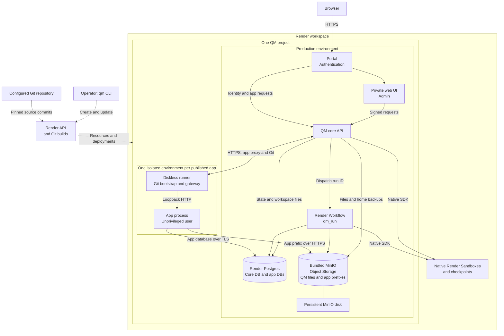

# Render

`qm init --target render` creates a deployment that uses the Render API.
Set `render.workspaceId` to the authorized test or production workspace. Set
`render.source.repo` and `render.source.branch` to a GitHub repository and branch
that local Git and Render can read. `--repo <url> --branch <name>` sets both at initialization.

Run `qm setup`, `qm check`, `qm plan`, then `qm up`. Keep the generated `.env`
private. Render stores the runtime values. The CLI records resource IDs in
`render.resources.json`; retain this file so updates act on the same resources.
After an unknown creation result, a retry searches the workspace for the named
resource, records it when it exists, and repeats the write when it is absent.
During service creation or resume, this record also stores encrypted credentials
until the pinned deployment succeeds. Keep the same local `CORE_SIGNING_SECRET`
until that operation finishes so a retry can restore the credentials.
The CLI removes a lock left by a process that has exited. A live process keeps
its lock. A lock without a valid PID has a five-second recovery delay; retry
after that delay if the process stopped before it recorded its PID.
Finish any Render operation started by an older CLI version before upgrading.
Use one CLI version per deployment directory.

The API creates one project and one production environment. The core services,
Render Postgres, bundled MinIO, and the worker Workflow use that environment.
Each published app has a network-isolated environment in the same project.
Native Render Sandboxes are workspace resources because the Sandbox API has no
project or environment field. Do not create a second project for sandboxes.

`render.appRegion` optionally selects the region for new published apps. It
defaults to `render.region`. Each app retains the region selected at creation.
Changing this default does not move existing apps, core services, or Postgres.
If a legacy Oregon workspace has no fixed outbound IP ranges, set
`render.appRegion` to `virginia` before creating an app. Apps remain in the same
project and connect across regions to Postgres with verified TLS and MinIO with
HTTPS.

## Architecture

This diagram shows the standard deployment with Portal enabled. Solid arrows
show runtime traffic. Dotted arrows show provisioning and builds.

Render builds the QM services, Workflow, and app runner from the configured
repository. The runner then fetches the published app's source from the core Git
endpoint. Core proxies app traffic through the runner's authenticated gateway.
Core and Workflow tasks use the Render API to manage app resources.

Only MinIO has an attached service disk. Core and Workflow tasks share durable
Postgres and object storage. An app can use only its own database and object
prefix, and its environment has no private network access to core or peer apps.
Archive and restore retain these data stores and credentials.

## Git builds and updates

Render builds every service from the configured repository. Core, web UI, and
portal use their existing Dockerfiles. MinIO uses
`deploy/render-minio/Dockerfile`, which pins its base image. Plugins use
`plugins/<name>/Dockerfile` in the same Git repository. Prebuilt image overrides
are not supported. Automatic deploys are off so `qm up` controls the update order.
Render starts an initial build when a service is created or resumed. The CLI
uses a command that exits and supplies no credentials until this build stops.
Workflow creation starts no version when automatic deploys are off. The CLI
completes the safe setup, then registers the selected commit with the runtime
credentials. If a Workflow version already exists during this setup, the CLI
waits for its build and registration to finish before it adds credentials.

The CLI initializes MinIO before it deploys the Workflow and core. The CLI resolves the branch once and pins the service builds and Workflow version
to that commit. Each routine update builds the diskless services. It retains MinIO without a redeploy when the
MinIO source and configuration are unchanged. A deliberate MinIO build or disk
change can interrupt object storage while Render starts its replacement.

`qm rollback` restores the previous successful service builds. It retains the
current operator environment values and does not reverse database migrations.
The prior commit and Workflow task are restored with the previous core build. Verify
compatibility before a rollback that follows a configuration or schema change.

## Data and credentials

Core stores durable state in Render Postgres and durable files in MinIO.
`/data` on core is temporary. A deployment must not depend on files that exist
only on a service's local filesystem.

Published apps have no disk. Each app receives its own Postgres database and
scoped object storage credentials. Apps must use these stores for persistent
data. Do not use SQLite or local uploads for durable app data. Do not expose the
Render API key, core database credentials, or MinIO root credentials to apps.
Apps connect to Postgres with verified TLS and to MinIO with HTTPS. The API adds
the apps' outbound IP ranges to this project's Postgres allowlist. It does not
change network rules outside the project.

MinIO root credentials remain on the MinIO service. Its initialization job
creates a private bucket and the scoped QM storage identity. Core and the worker
Workflow receive that identity. Do not rotate or replace the root credentials
unless the stored data and dependent credentials have been checked.

Archive an app with the built-in deployment tools to suspend its Render service
and disable its database and object storage credentials. Archive retains the
service, database, and objects. Restore the app with the same tools. Verify
retained records and file contents after restore. Direct Render service deletion
is part of permanent cleanup below; it does not run the QM archive flow.

## Operations

`qm status`, `qm logs`, and `qm check --live` inspect the recorded resources.
`qm secrets push` stores changed operator secrets. Run `qm up` to use them.
`qm down` stops services and retains Postgres and the MinIO disk. Stored data
continues to incur charges. Archive published apps before stopping their parent
deployment.

### Permanent cleanup

`qm down --purge` deletes the recorded QM services, Workflow, Postgres, and MinIO
disk. This deletes QM state, app databases, and stored objects. Archive cannot
restore an app after its data has been purged. Use this procedure only with
explicit authorization to delete the deployment and its stored data.

1. Stop new app publication and agent work. Back up app source, databases, and
   objects to storage outside this deployment before archive disables access.
2. Archive each published app through QM. Confirm that each app is archived
   and its Render service is suspended. Archive alone does not permit purge;
   the CLI also refuses suspended app services that still use shared storage.
3. Use QM's sandbox resource `retire` action for the deployment's sandboxes
   while core is available. Retirement deletes the sandbox and its retained
   snapshots. Export any files that must be kept before retirement.
4. In Render, open the workspace and project recorded in
   `render.resources.json`. Match each app service's `QM_DEPLOYMENT_ID`
   environment variable to its QM app ID. Delete only these app services in
   Render, or use `DELETE /v1/services/{serviceId}` for the verified IDs.
   This removes the app runners; their databases and objects remain until purge.
5. Run `qm down --purge` from this deployment directory. Keep
   `render.resources.json` until cleanup succeeds. If cleanup is interrupted,
   run the same command again to complete it.

Purge retains the Render project and environments. It does not delete workspace
sandboxes or snapshots; those must be retired before core is removed.

Do not change unrelated infrastructure, DNS, or Cloudflare rules. The assigned
`onrender.com` URLs are sufficient for this target.
