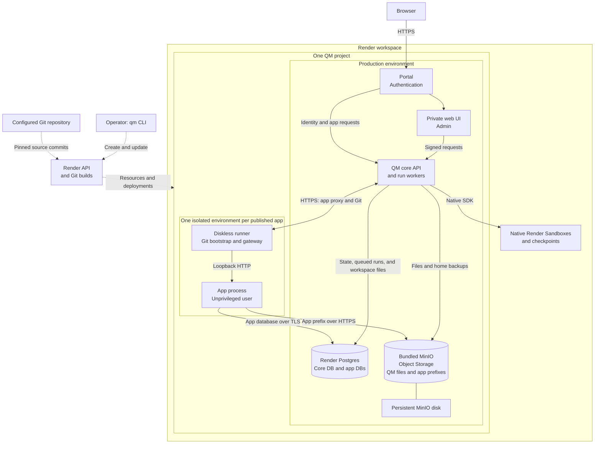

# Render

`qm init --target render` creates a deployment that uses the Render API.
Set `render.workspaceId` to the authorized test or production workspace. Set
`render.source.repo` and `render.source.branch` to a GitHub repository and branch
that local Git and Render can read. `--repo <url> --branch <name>` sets both at initialization.

Run `qm setup`, `qm check`, `qm plan`, then `qm up`. The CLI uses the Render API
directly; the deployment needs no Blueprint. Keep the generated `.env`
private. Render stores the runtime values. The CLI records resource IDs in
`render.resources.json`; retain this file so updates act on the same resources.
After an unknown creation result, a retry searches the workspace for the named
resource, records it when it exists, and repeats the write when it is absent.
`qm up`, `qm down`, `qm rollback`, and `qm secrets push` take `.render.lock` in
the deployment directory. A second such command waits up to 30 seconds for the
holder, reclaims a lock whose process has exited or that recorded no process for
more than five seconds, and otherwise stops with an error.

The API creates one project and one production environment. The core services,
Render Postgres, and bundled MinIO use that environment.
Each published app has a network-isolated environment in the same project.
Native Render Sandboxes are workspace resources because the Sandbox API has no
project or environment field. Do not create a second project for sandboxes.

`render.corePlan`, `render.servicePlan`, and `render.storage.plan` take Render compute
plan IDs such as `2c-4g`. Legacy names such as `standard` are accepted and
normalized to their plan IDs, so the name Render echoes never causes a redeploy.
`render.postgresPlan` is passed through unchanged. `render.corePlan` defaults to
`2c-4g`, which fits the default 16 run workers that core runs; a smaller core
plan needs a lower `env.core.WORKERS`.

`render.appRegion` optionally selects the region for new published apps. It
defaults to `render.region`. Each app retains the region selected at creation.
Changing this default does not move existing apps, core services, or Postgres.
Apps in another region remain in the same project and connect across regions to
Postgres with verified TLS and MinIO with HTTPS.

## Architecture

This diagram shows the standard deployment with Portal enabled. Solid arrows
show runtime traffic. Dotted arrows show provisioning and builds.



Render builds the QM services and the app runner from the configured
repository. Core runs the run workers in its own process. A core deploy starts
the new instance first, then Render sends SIGTERM to the previous instance.
That instance stops claiming runs and gives in-flight turns
`env.core.SHUTDOWN_DRAIN_MS` milliseconds (default 10000) to finish. A turn that
is still active at that deadline stops; its run lease is released and the turn
restarts on the new instance. Render ends the previous instance 300 seconds
after SIGTERM, so keep `SHUTDOWN_DRAIN_MS` below 290000 when you raise it for
long turns. The runner fetches the published app's source from the core Git
endpoint and reports the app ready when the app accepts connections on its
`PORT`. It repeats that connection check every five seconds and reports the app
unavailable after three consecutive failures, so Render restarts an instance
whose app stopped listening. The runner sends no HTTP requests to the app. Core
proxies app traffic through the runner's authenticated gateway.
The runner starts the app as a dedicated user outside group 1000, so Render
secret files, which Render makes readable to group 1000, stay unreadable to the
app, and it refuses to start an app beside a manifest that user could read.
Core uses the Render API to manage app resources.

Only MinIO has an attached service disk. Core keeps its durable state in
Postgres and object storage. An app can use only its own database and object
prefix, and its environment has no private network access to core or peer apps.
Archive and restore retain these data stores and credentials.

## Git builds and updates

Render builds every service from the configured repository. Core, web UI, and
portal use their existing Dockerfiles. MinIO uses
`deploy/render-minio/Dockerfile`, which pins its base image. Plugins use
`plugins/<name>/Dockerfile` in the same Git repository. Prebuilt image overrides
are not supported. Automatic deploys are off so `qm up` controls the update order.
Render starts an initial build when a service is created or resumed. The CLI
creates and resumes services with a command that exits, sets the real command,
cancels the automatic build and waits for it to settle, then deploys the pinned
commit. A retry after an interruption cancels any build still running and
deploys the current commit.

The CLI initializes MinIO before it deploys core. The CLI
resolves the branch once and pins the service builds to that commit. Each
routine update builds the diskless services. It retains MinIO without a redeploy when its
repository, branch, Dockerfile path, command, health check, plan, disk, and environment
variables are unchanged and its last deploy succeeded. A new
pinned digest in `deploy/render-minio/Dockerfile` alone does not rebuild MinIO;
trigger a manual deploy of the MinIO service in the Render dashboard for that.
A MinIO build or disk change interrupts object storage while Render starts its
replacement.

`qm rollback` restores the previous successful service builds. It retains the
current operator environment values and does not reverse database migrations.
The prior commit is restored with the previous core build. Verify
compatibility before a rollback that follows a configuration or schema change.
`qm rollback` takes no `--to`; it targets the release before the current one,
or the last successful release after an interrupted `qm up`.

## Data and credentials

Core stores durable state in Render Postgres and durable files in MinIO.
`/data` on core is temporary. A deployment must not depend on files that exist
only on a service's local filesystem. Do not expire durable objects or move data
between storage targets automatically.

Published apps have no disk. Each app receives its own Postgres database and
scoped object storage credentials. Apps must use these stores for persistent
data. Do not use SQLite or local uploads for durable app data. Do not expose the
Render API key, core database credentials, or MinIO root credentials to apps.
Apps connect to Postgres with verified TLS and to MinIO with HTTPS. The API adds
the apps' outbound IP ranges to this project's Postgres allowlist. It does not
change network rules outside the project. Render shares outbound IP ranges across
the services in a region, so the allowlist admits other Render tenants in that
region to the password-protected external Postgres endpoint. The first app
deployment also revokes the default PUBLIC connect privilege on the core database;
grant CONNECT explicitly to any extra role that reads it. App source manifests
carry Git tokens signed with `CORE_SIGNING_SECRET`; after rotating that secret,
redeploy each app so Render restarts can fetch its source again.

MinIO root credentials remain on the MinIO service. Its initialization job
creates a private bucket and the scoped QM storage identity. Core receives that
identity. Do not rotate or replace the root credentials
unless the stored data and dependent credentials have been checked.

Archive an app with the built-in deployment tools to suspend its Render service
and disable its database and object storage credentials. Archive retains the
service, database, and objects. Restore the app with the same tools. Verify
retained records and file contents after restore. Direct Render service deletion
is part of permanent cleanup below; it does not run the QM archive flow.

## Agent-computer proof

Native Render Sandboxes have no operator shell, so read the proof file from the
durable home archive that core writes to MinIO at each checkpoint. The archive
of a scope is the object `render-home/<url-encoded scope id>.tar` in the
`qm-storage` bucket. A checkpoint runs at turn end when the home changed, at
most once per five minutes, and the reaper covers a throttled one within about
ten minutes, so wait for one before you read. Use the MinIO service's
onrender.com URL, the `qm-storage` access key, and the `QM_STORAGE_SECRET_KEY`
value from the MinIO service's environment in the Render dashboard:

```bash
scope_id='personal:<exact-admin-principal>'
key="render-home/$(node -p 'encodeURIComponent(process.argv[1])' "$scope_id").tar"
mc alias set qm https://<prefix>-minio.onrender.com qm-storage "$QM_STORAGE_SECRET_KEY"
mc cat "qm/qm-storage/$key" | tar -xOf - ./workspace/qm-computer-proof.txt
```

## Operations

`qm status`, `qm logs`, and `qm check --live` inspect the recorded resources.
`qm secrets push` stores changed operator secrets. Run `qm up` to use them.
`qm down` suspends the services. Postgres keeps running, and it and the MinIO
disk continue to incur charges. Archive published apps before stopping their parent
deployment.

### Permanent cleanup

`qm down --purge` deletes the recorded QM services, Postgres, and MinIO
disk. This deletes QM state, app databases, and stored objects. Archive cannot
restore an app after its data has been purged. Use this procedure only with
explicit authorization to delete the deployment and its stored data.

1. Stop new app publication and agent work. Back up app source, databases, and
   objects to storage outside this deployment before archive disables access.
2. Archive each published app through QM. Confirm that each app is archived
   and its Render service is suspended. Archive alone does not permit purge;
   the CLI also refuses suspended app services that still use shared storage.
3. Use QM's sandbox resource `retire` action for the deployment's sandboxes
   while core is available. Retirement deletes the sandbox and its retained
   snapshots. Export any files that must be kept before retirement.
4. In Render, open the workspace and project recorded in
   `render.resources.json`. Match each app service's `QM_DEPLOYMENT_ID`
   environment variable to its QM app ID. Delete only these app services in
   Render, or use `DELETE /v1/services/{serviceId}` for the verified IDs.
   This removes the app runners; their databases and objects remain until purge.
5. Run `qm down --purge` from this deployment directory. Keep
   `render.resources.json` until cleanup succeeds. If cleanup is interrupted,
   run the same command again to complete it.

Purge retains the Render project and environments. It does not delete workspace
sandboxes or snapshots; those must be retired before core is removed.

Do not change unrelated infrastructure, DNS, or Cloudflare rules. The assigned
`onrender.com` URLs are sufficient for this target.
