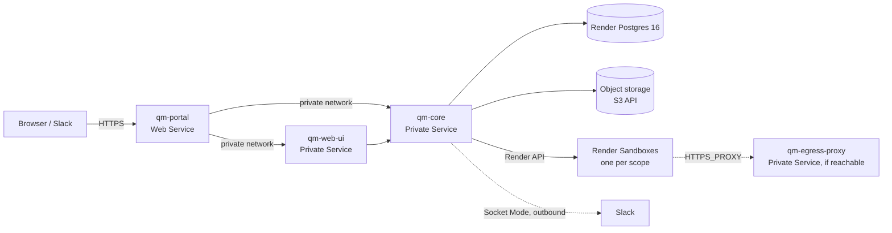

# Running qm on Render

A plan for hosting qm on Render: Render Sandboxes as the agent computer and the control
plane on Render, delivered as one phase, then Render as a first-class `qm` deployment
target. Written against the qm tree at `234022f` and the Render public API as reflected in
`render-oss/sdk` and `render-oss/cli` (September 2026). Everything here that touches core
qm is upstream work; this fork keeps only its own layer under `deploy/layers/render/`.

## Summary

qm is three long-running Node services (core, web-ui, portal), Postgres, an S3-style
object store, and an "agent computer" backend that runs the model's shell commands in an
isolated machine per scope. All of that maps onto Render today, in two tiers:

- **Maps directly, no code changes**: portal as a Web Service, core and web-ui as Private
  Services on the workspace private network, Render Postgres 16, Render's zero-downtime
  deploys and `maxShutdownDelaySeconds` (qm's drain model already assumes exactly this),
  env groups and generated secrets, one-off Jobs for migrations and the live canary.
- **Maps onto early-access Render primitives, needs code**: agent computers on
  **Render Sandboxes** (`POST /sandboxes`, token-brokered exec and file streams,
  filesystem and runtime snapshots), and file bytes on **Render Object Storage** once it
  hands out S3 credentials (any S3-compatible bucket works in the meantime).

Recommended sequence:

| Phase | Outcome                                                                                                                                                                                                | Depends on                                                    | Rough size             |
| ----- | ------------------------------------------------------------------------------------------------------------------------------------------------------------------------------------------------------ | ------------------------------------------------------------- | ---------------------- |
| 1     | The Render-only stack: a `render` sandbox backend built first against the local dev instance, then the control plane live on Render from a Blueprint with `SANDBOX_BACKEND=render` from the first boot | Sandboxes early access; the §3 questions answered in week one | about two weeks        |
| 2     | `qm init --target render`: Render in the CLI's hosting-provider registry next to Fly and AWS                                                                                                           | Phase 1 learnings                                             | 2–3 weeks              |
| 3     | `DEPLOY_PROVIDER=render` so apps the agent publishes run on Render                                                                                                                                     | a Render primitive that does not exist yet (see §6)           | spike now, build later |

An earlier draft started with the control plane on a third-party sandbox backend and
added Render Sandboxes afterwards. That ordering is dropped. Render's own instance should
not depend on a competitor's sandbox product; no existing backend can drive Render's API
(`local` needs a Docker daemon that core does not have on Render, and `aws` reaches an
agent through an inbound port that Render Sandboxes do not expose); and building the
backend first answers the questions the rest of the plan waits on. Core constructs every
sandbox backend whose credential is present and routes per scope, so another backend's
key can stay in the environment as a fallback route without changing the plan.

The single most valuable thing Render can add for this workload is a **domain allowlist on
the sandbox network policy** (today it is only `allow-all` / `deny-all`). With it, qm gets
enforced egress on Render without running its Envoy proxy at all. §8 lists the other gaps.

## 1. What qm needs from a host

Facts from the code, so the mapping in §2 is checkable.

### Workloads

| Workload                                          | Image                                               | Port                            | Exposure                                 | Health         | Notes                                                                                                                                                                                                                                                                                                                                                                                                                                                  |
| ------------------------------------------------- | --------------------------------------------------- | ------------------------------- | ---------------------------------------- | -------------- | ------------------------------------------------------------------------------------------------------------------------------------------------------------------------------------------------------------------------------------------------------------------------------------------------------------------------------------------------------------------------------------------------------------------------------------------------------ |
| core                                              | `deploy/core/Dockerfile` (build context: repo root) | 8080                            | private only                             | `GET /healthz` | Runs Postgres migrations at boot under an advisory lock, then listens. Hosts the Slack surface in-process over outbound Socket Mode (no ingress). Drains on SIGTERM (`SHUTDOWN_DRAIN_MS`, default 10 s; Fly gives it a 300 s kill timeout). Blue-green safe only with Postgres: leader leases, pg-boss singleton jobs, and an `instance_heartbeats` registry keyed by `GIT_SHA` that makes an older build stop claiming runs when a newer one is live. |
| web-ui (admin at `/admin`)                        | `deploy/web-ui/Dockerfile`                          | 8080                            | private only                             | `GET /healthz` | Stateless; SSE to browsers is implemented by polling core, so no instance affinity.                                                                                                                                                                                                                                                                                                                                                                    |
| portal (auth broker embedded on `127.0.0.1:8099`) | `deploy/portal/Dockerfile`                          | 8080                            | **the only public service**              | `GET /healthz` | Authenticates over OIDC and proxies web-ui and admin. Sets the sign-in and app-serving cookies.                                                                                                                                                                                                                                                                                                                                                        |
| egress-proxy (optional)                           | `deploy/egress-proxy/Dockerfile`                    | 48080, raw TCP (HTTP `CONNECT`) | must be reachable **from the sandboxes** | TCP            | Envoy plus a Node decision service. Sandboxes get `HTTPS_PROXY=https://x:<per-turn token>@proxy:48080`. Without it the backend declares `egressEnforcement: "none"` and core logs a fail-open warning. `NET_ADMIN` is optional (metadata firewall).                                                                                                                                                                                                    |

All three application images are published digest-pinned and cosign-signed at
`ghcr.io/yc-software/qm/<service>@sha256:…` by the release workflow, so a host can either
build from the Dockerfiles or pull prebuilt images.

### Data

- **Postgres 16** (`btree_gin`; session advisory locks; `LISTEN`/`NOTIFY`; pg-boss in the
  `pgboss` schema). Transaction pooling is supported via `DATABASE_POOL_URL` for ordinary
  queries, but `DATABASE_URL` must still point at a direct endpoint for locks,
  subscriptions, migrations and pg-boss (`docs/pgbouncer.md`).
- **Object storage over the S3 API** for file bytes, uploads, session shares and the
  published-app git archives: `SNAPSHOT_STORE=s3`, `TRANSFER_STORE=s3`, `S3_BUCKET`,
  `S3_REGION`, plus `AWS_ACCESS_KEY_ID`, `AWS_SECRET_ACCESS_KEY` and
  `AWS_ENDPOINT_URL_S3` (this is exactly how the Fly target wires Tigris). Without it
  those bytes land under `DATA_DIR` on local disk, which on Render is either ephemeral or
  a persistent disk, and a disk pins the service to one instance and disables
  zero-downtime deploys.
- **No Redis.** qm does not use one.
- **A sandbox backend is mandatory in production** (`SANDBOX_BACKEND` has no default);
  eight exist today: `sprites`, `smolmachines`, `e2b`, `modal`, `porter`, `agent37`,
  `aws`, `local`. `render` is the ninth (§3).

### Secrets (`src/deployment/secret-schema.ts` is authoritative)

Always in production: `CORE_SIGNING_SECRET`, `CAPABILITY_SECRET`,
`PORTAL_IDENTITY_SECRET`, `CONNECTOR_SECRET_KEY`, `SKILL_SIGNING_SECRET` (the signing
ones must be strong, e.g. 32 random bytes). Then the model key for `MODEL_PROVIDER`,
`DATABASE_URL`, the sandbox backend's token, `ADMIN_GRANTS=<email>:org_admin` before
first boot, the portal's `PORTAL_SESSION_SECRET`, and with the built-in broker
`AUTH_CLIENT_SECRET`/`OIDC_CLIENT_SECRET`, `AUTH_TOKEN_SECRET`, `AUTH_SIGNING_JWK`
(P-256), a sender and a mail transport (or Slack sign-in instead of email).

## 2. Target architecture on Render



| qm piece                        | Render resource                                                                                                                                                            | Notes                                                                                                                                                                                                                                               |
| ------------------------------- | -------------------------------------------------------------------------------------------------------------------------------------------------------------------------- | --------------------------------------------------------------------------------------------------------------------------------------------------------------------------------------------------------------------------------------------------- |
| portal                          | `type: web`, `runtime: docker`, `healthCheckPath: /healthz`, custom domain                                                                                                 | Public URL becomes `publicUrl`. Portal derives every other URL from it.                                                                                                                                                                             |
| web-ui                          | `type: pserv`, `runtime: docker`                                                                                                                                           | Reached as `http://qm-web-ui:8080` (internal hostname is the service name unless it collided; read it from the Connect panel or `fromService`).                                                                                                     |
| core                            | `type: pserv`, `runtime: docker`, `maxShutdownDelaySeconds: 300`                                                                                                           | Same grace as Fly's `kill_timeout`. Private services have no HTTP health-check field in the API; readiness is port-based, which is acceptable because core only listens after migrations and hydration succeed.                                     |
| egress-proxy                    | `type: pserv` on 48080, only if sandboxes can reach the private network                                                                                                    | See §4.                                                                                                                                                                                                                                             |
| Postgres                        | Render Postgres, major version 16, Pro instance type for HA and 7-day PITR, internal connection string                                                                     | Optional: enable Render's built-in PgBouncer and hand its pool string to `DATABASE_POOL_URL`, keeping `DATABASE_URL` direct.                                                                                                                        |
| Object storage                  | Render Object Storage when it exposes S3 credentials; until then an S3-compatible bucket via `AWS_ENDPOINT_URL_S3`                                                         | qm's stores use the AWS SDK (including presigned uploads), so the requirement is "speaks S3", not "is AWS". The current early-access Object Storage client is presign-through-the-Render-API only, which qm cannot use without a new store adapter. |
| Agent computers                 | Render Sandboxes through the `render` backend (§3); a second backend's key may stay in the environment as a per-scope fallback route                                       | One sandbox per scope, persisted as snapshot lineage.                                                                                                                                                                                               |
| Migrations                      | boot-time (already advisory-locked); optionally `preDeployCommand: node src/migrate-main.ts` on core                                                                       | The pre-deploy command runs in the new image before traffic switches, with env and private-network access.                                                                                                                                          |
| Live canary (`qm check --live`) | one-off Job on the core service (`POST /services/{id}/jobs`)                                                                                                               | The AWS target does the same with an ECS one-off task.                                                                                                                                                                                              |
| Blue-green drain                | Render's rolling deploy plus qm's `instance_heartbeats`                                                                                                                    | Needs `GIT_SHA` set per build; on Render derive it from `RENDER_GIT_COMMIT` in the start command (`sh -c 'export GIT_SHA=$RENDER_GIT_COMMIT; exec node src/index.ts'`) or pass it as a build arg.                                                   |
| Secrets                         | `generateValue: true` for the five signing secrets, `fromService … envVarKey` to share them, `sync: false` for operator-supplied keys, an env group for shared non-secrets | Render's generated values are 256-bit, which satisfies qm's strong-secret check.                                                                                                                                                                    |
| Region                          | one region for everything                                                                                                                                                  | The private network is per workspace **and** region.                                                                                                                                                                                                |

### Blueprint draft (Phase 1)

This draft belongs at `deploy/layers/render/render.yaml` once Phase 1 deploys (it is
inlined here so the plan reads on its own); Phase 2 turns it into a CLI template that
`qm plan` renders. Prebuilt images are the alternative to `runtime: docker`:
`runtime: image` with `image.url: ghcr.io/yc-software/qm/core@sha256:…` from the release
manifest, which is how the Fly and AWS targets pin releases.

```yaml
databases:
  - name: qm-db
    plan: pro_4gb
    postgresMajorVersion: "16"
    region: oregon
    ipAllowList: []

services:
  - type: pserv
    name: qm-core
    runtime: docker
    region: oregon
    plan: pro
    dockerfilePath: ./deploy/core/Dockerfile
    dockerContext: .
    dockerCommand: sh -c 'export GIT_SHA="$RENDER_GIT_COMMIT"; exec node src/index.ts'
    maxShutdownDelaySeconds: 300
    numInstances: 1
    autoDeployTrigger: off
    envVars:
      - { key: PORT, value: "8080" }
      - { key: ORG_ID, value: render }
      - { key: HARNESS, value: pi }
      - { key: MODEL_PROVIDER, value: anthropic }
      - { key: ANTHROPIC_API_KEY, sync: false }
      - { key: SESSION_STORE, value: postgres }
      - { key: RUN_STORE, value: postgres }
      - key: DATABASE_URL
        fromDatabase: { name: qm-db, property: connectionString }
      - { key: SNAPSHOT_STORE, value: s3 }
      - { key: TRANSFER_STORE, value: s3 }
      - { key: S3_BUCKET, sync: false }
      - { key: S3_REGION, value: auto }
      - { key: AWS_ENDPOINT_URL_S3, sync: false }
      - { key: AWS_ACCESS_KEY_ID, sync: false }
      - { key: AWS_SECRET_ACCESS_KEY, sync: false }
      - { key: PUBLIC_WEB_URL, value: https://qm.example.com }
      - { key: WEB_UI_PUBLIC_URL, value: https://qm.example.com }
      - { key: REQUIRE_SIGNED_PORTAL_IDENTITY, value: "1" }
      - { key: ADMIN_GRANTS, sync: false }
      - { key: CORE_SIGNING_SECRET, generateValue: true }
      - { key: CAPABILITY_SECRET, generateValue: true }
      - { key: PORTAL_IDENTITY_SECRET, generateValue: true }
      - { key: CONNECTOR_SECRET_KEY, generateValue: true }
      - { key: SKILL_SIGNING_SECRET, generateValue: true }
      - { key: SANDBOX_BACKEND, value: render }
      - { key: RENDER_API_KEY, sync: false }
      - { key: RENDER_OWNER_ID, sync: false }
      - { key: RENDER_REGION, value: oregon }
      - { key: RENDER_SANDBOX_PLAN, value: starter }
      - { key: RENDER_SANDBOX_TIMEOUT_SEC, value: "86400" }
      - { key: RENDER_SANDBOX_BASE_SNAPSHOT_ID, sync: false }

  - type: pserv
    name: qm-web-ui
    runtime: docker
    region: oregon
    plan: standard
    dockerfilePath: ./deploy/web-ui/Dockerfile
    dockerContext: .
    autoDeployTrigger: off
    envVars:
      - { key: PORT, value: "8080" }
      - { key: CORE_API_URL, value: http://qm-core:8080 }
      - { key: CORE_ORG_ID, value: render }
      - key: CORE_SIGNING_SECRET
        fromService: { type: pserv, name: qm-core, envVarKey: CORE_SIGNING_SECRET }
      - key: PORTAL_IDENTITY_SECRET
        fromService: { type: pserv, name: qm-core, envVarKey: PORTAL_IDENTITY_SECRET }
      - { key: WEB_UI_PUBLIC_URL, value: https://qm.example.com }
      - { key: ADMIN_ENABLED, value: "1" }
      - { key: ADMIN_BASE_PATH, value: /admin }

  - type: web
    name: qm-portal
    runtime: docker
    region: oregon
    plan: standard
    dockerfilePath: ./deploy/portal/Dockerfile
    dockerContext: .
    healthCheckPath: /healthz
    maxShutdownDelaySeconds: 30
    autoDeployTrigger: off
    domains: [qm.example.com]
    envVars:
      - { key: PORT, value: "8080" }
      - { key: CORE_API_URL, value: http://qm-core:8080 }
      - { key: CORE_ORG_ID, value: render }
      - key: CORE_SIGNING_SECRET
        fromService: { type: pserv, name: qm-core, envVarKey: CORE_SIGNING_SECRET }
      - key: PORTAL_IDENTITY_SECRET
        fromService: { type: pserv, name: qm-core, envVarKey: PORTAL_IDENTITY_SECRET }
      - { key: PORTAL_PUBLIC_URL, value: https://qm.example.com }
      - { key: PORTAL_SESSION_SECRET, generateValue: true }
      - { key: PORTAL_XFF_TRUSTED_HOPS, value: "1" }
      - { key: WEB_UI_UPSTREAM, value: http://qm-web-ui:8080 }
      - { key: ADMIN_UPSTREAM, value: http://qm-web-ui:8080/admin }
      # Built-in sign-in broker, embedded in portal (brokerWiring in cli/src/services.ts):
      - { key: AUTH_EMBEDDED, value: "1" }
      - { key: AUTH_BROKER_UPSTREAM, value: http://127.0.0.1:8099 }
      - { key: AUTH_BROKER_PREFIX, value: /idp }
      - { key: AUTH_ISSUER, value: https://qm.example.com/idp }
      - { key: AUTH_CLIENT_ID, value: qm-portal }
      - { key: AUTH_REDIRECT_URI, value: https://qm.example.com/auth/callback }
      - { key: AUTH_CLIENT_SECRET, sync: false }
      - { key: AUTH_TOKEN_SECRET, generateValue: true }
      - { key: AUTH_SIGNING_JWK, sync: false }
      - { key: AUTH_EMAIL_FROM, sync: false }
      - { key: AUTH_EMAIL_TRANSPORT, value: smtp }
      - { key: OIDC_CLIENT_ID, value: qm-portal }
      - { key: OIDC_CLIENT_SECRET, sync: false }
      - { key: OIDC_ISSUER, value: https://qm.example.com/idp }
      - { key: OIDC_AUTH_ENDPOINT, value: https://qm.example.com/idp/authorize }
      - { key: OIDC_TOKEN_ENDPOINT, value: http://127.0.0.1:8099/token }
      - { key: OIDC_USERINFO_ENDPOINT, value: http://127.0.0.1:8099/userinfo }
      - { key: OIDC_JWKS_URI, value: http://127.0.0.1:8099/.well-known/jwks.json }
      - { key: OIDC_SCOPES, value: openid email }
      - { key: OIDC_PRINCIPAL_CLAIM, value: email }
      - { key: OIDC_ALLOWED_EMAIL_DOMAIN, value: render.com }
```

Notes on the draft:

- `AUTH_CLIENT_SECRET` and `OIDC_CLIENT_SECRET` must carry the same value, and
  `AUTH_SIGNING_JWK` must be a P-256 private JWK. A Blueprint cannot express "one generated
  value under two names", so in Phase 1 they are generated locally the way `qm setup`
  does and pasted as `sync: false`; the Phase 2 target pushes them.
- `CORE_API_URL` and the upstreams assume the internal hostname equals the service name.
  If Render assigns a suffixed name, switch those entries to `fromService … property:
host` plus the port, or set them after the first apply the way the Porter runbook does.
- Slack: enter the bot and app tokens on the Admin page after first boot (core prefers the
  stored installation over env), so nothing Slack-specific needs to be in the Blueprint.
- `DEPLOY_PROVIDER` is left unset, so core selects `docker`, finds no daemon, and logs that
  publishing is unavailable. That is the honest state until Phase 3; a deployment that
  already has Fly, Porter or AWS credentials can point `DEPLOY_PROVIDER` there instead.
- Two entries wait on the private-network question in §3. If Render Sandboxes can reach
  the workspace private network, add `PUBLIC_API_URL=http://qm-core:8080` to core
  (sandboxes then call core directly for blob staging) and deploy the egress proxy as a
  fourth service with `RENDER_SANDBOX_EGRESS_PROXY_URL=http://qm-egress-proxy:48080`. If
  they cannot, leave both out: blob staging is simply not advertised while
  `PUBLIC_API_URL` is unset, and egress runs unenforced with the backend saying so.
- `RENDER_SANDBOX_TIMEOUT_SEC` is the 24-hour maximum because the first cut of the
  backend snapshots at session end and only rotates bodies before expiry in its second
  week (§3).

## 3. Phase 1 — the Render-only stack

Goal: qm on Render with nothing third-party in the path except the model provider and,
until Render Object Storage hands out S3 credentials, the bucket. The phase has two halves
that ship together but are built apart: the sandbox backend, developed against the local
dev instance; then the control plane, deployed from the Blueprint with that backend
selected from the first boot. The Agent37 ADR (`adrs/agent37-sandbox-backend.md`) is the
template for the backend half: one file modeled on an existing backend, an in-process fake
of the vendor API, tests, and no new CLI target.

### Week one: the questions that shape the backend

Answer these before the first line of code; each decides something concrete.

1. Can a sandbox reach the workspace private network? Decides whether `PUBLIC_API_URL` is
   the private core address and whether the egress proxy runs as a Private Service (§4),
   or both wait.
2. What are the run duration and output limits behind a connect token, and how long is
   the token valid? Sets the detached-and-poll threshold and the spool size in `run`.
3. What puts a sandbox into `suspended`, what resumes it, and is idle time billed?
   Decides whether the backend terminates idle bodies to a snapshot or leaves them
   suspended.
4. What are the default and maximum snapshot lifetimes (`expiresAt`), and is there a
   size cap? Scope snapshots must outlive any default, so the backend sets `expiresAt`
   explicitly if it can.
5. What is the default per-group `concurrencyLimit`, and should qm get its own group?
   Decides the provisioning error path when the org outgrows the group.
6. What does the base image contain (user, home directory, Node, Python, git), and how
   much of the tool contract in `fly/Dockerfile` has to be installed into the golden
   snapshot?
7. Can a sandbox carry a name or label? If not, the backend injects `QM_SCOPE` into `env`
   and the dashboard shows ids only.

### The backend

The shape follows from the API:

| `Sandbox` interface member                                           | Render API                                                                                                                                                 | Notes                                                                                                                                                                                                                                                 |
| -------------------------------------------------------------------- | ---------------------------------------------------------------------------------------------------------------------------------------------------------- | ----------------------------------------------------------------------------------------------------------------------------------------------------------------------------------------------------------------------------------------------------- |
| `provision`                                                          | `POST /sandboxes` with `plan`, `timeoutSeconds`, `env`, `region`, `networkPolicy`, and `snapshotId` = the scope's last snapshot; poll until `running`      | One sandbox per scope. A durable map `render_sandbox_bodies` (scope → sandbox id, group id, latest snapshot id) in Postgres, and the shared advisory lock so two core replicas never create two bodies for one scope (the Agent37 backend does both). |
| `run`                                                                | `POST /sandboxes/{id}/runs/stream/token`, then `POST` the returned proxy `uri` with the bearer `token`; SSE `output`/`exit` events                         | The token is single-operation and short-lived. Commands longer than the run ceiling go detached and are polled, and large output is spooled to disk and read back in chunks, via the shared exec helpers.                                             |
| `readFile`, `writeFile`, `*Bytes`, `exportFiles`                     | `files/{upload,download}/token` then stream (`application/octet-stream` for a file, `application/x-tar` for a directory); `GET /sandboxes/{id}/files/list` | No base64-over-exec round trips needed, unlike Porter and Agent37.                                                                                                                                                                                    |
| process sessions, read-only layers, layer tool install, blob staging | shared exec helpers, unchanged                                                                                                                             |                                                                                                                                                                                                                                                       |
| `teardown` / idle                                                    | `POST /sandboxes/{id}/snapshots` (`kind: filesystem`), wait `available`, then `POST …/terminate`                                                           | Persistence is snapshot lineage: `writablePersistence: "provider_managed"`, the same class as E2B and Modal native snapshots. `filesystem` snapshots restore onto any plan; `runtime` snapshots also carry memory but pin the plan.                   |
| lifetime rotation                                                    | snapshot, then recreate from it before `timeoutSeconds` expires                                                                                            | Sandboxes have a hard maximum lifetime (default 7200 s, up to 86400 s). qm already rotates bodies on Modal and AWS (`MODAL_ROTATE_AFTER_SEC`, `AWS_SANDBOX_ROTATE_AFTER_SEC`).                                                                        |
| `reapDeepIdle`, `computerStatus`, `restartComputer`, `destroyScope`  | snapshot + terminate; `GET /sandboxes/{id}`; terminate + recreate; terminate + delete the scope's snapshots                                                |                                                                                                                                                                                                                                                       |
| egress                                                               | `networkPolicy.default: allow-all`, plus the forced-proxy env when `RENDER_SANDBOX_EGRESS_PROXY_URL` is set                                                | Declare `egressEnforcement: "domain"` only when the proxy is set and reachable, otherwise `"none"`, as the other backends do.                                                                                                                         |

Configuration: `SANDBOX_BACKEND=render`; `RENDER_API_KEY` (required, gated in
`secret-schema.ts` and mirrored in `cli/src/secrets.ts`); `RENDER_OWNER_ID` (the
workspace); `RENDER_REGION`; `RENDER_SANDBOX_PLAN` (`starter` / `standard` / `pro`);
`RENDER_SANDBOX_TIMEOUT_SEC`; `RENDER_SANDBOX_GROUP_ID` (optional, otherwise the default
group); `RENDER_SANDBOX_BASE_SNAPSHOT_ID`; `RENDER_SANDBOX_EGRESS_PROXY_URL`; and the
shared `SANDBOX_TIMEOUT_SEC`.

The base snapshot replaces image plumbing: a bootstrap step creates a sandbox from
Render's base image, installs the tool contract that `fly/Dockerfile` documents (Node 24,
Python, git, `gh`, the AWS CLI, the agent venv), snapshots it, and records the id. Every
scope's first body starts from that snapshot; the org layer's tools and skills still
arrive through the deployment-layer sync, so the snapshot rarely changes. Doing this once
by hand with `render ea sandboxes create`, `copy` and `snapshots create` is also the
fastest way to learn the base image and answer question 6.

Files, mirroring the Agent37 change: `src/sandbox/render-sandbox.ts` and a thin
`src/sandbox/render-client.ts` (the `@renderinc/sdk` package exists, but its sandbox
client is marked early access with breaking changes and qm's dependency cooldown makes a
small hand-written client the safer choice); the compile-time records in
`src/config.ts`, `src/wiring.ts` and `src/sandbox/sandbox-routing.ts`; the secret gates;
`cli/src/providers.ts` (`SandboxBackendId` and the per-target policy);
`test/render-sandbox.test.ts` with `test/support/fake-render.ts` (the fake has to model
the token-then-proxy flow, snapshots and the lifetime cap); the live scenario in
`test/live-slack/scenarios-sandbox-providers.ts`; a `scripts/render-sandbox-smoke.ts`
like the E2B and Modal smokes; `docs/sandbox-preservation.md`; `.env.example`. The dev
instance is the development loop: `scripts/dev/cli.ts` gains `render` in its `--sandbox`
list and `scripts/dev/lib/sandbox.ts` the credential check, so
`bash scripts/dev-instance.sh up --sandbox render` runs a laptop-hosted core against real
Render Sandboxes, with the supervisor's cloudflared tunnel supplying `PUBLIC_API_URL` for
that arrangement as it already does for E2B, Modal and Sprites. Upstream the backend with
an ADR in the style of `adrs/agent37-sandbox-backend.md`.

#### Enough for the first deploy, and what can trail

Enough for the first deploy: `provision` from the scope's latest snapshot or the golden
one; `run` over the stream token; native file upload and download; `teardown` as a
filesystem snapshot followed by terminate; the Postgres body map and the advisory lock;
`networkPolicy: allow-all` with `egressEnforcement: "none"` declared honestly; the golden
snapshot; the fake and the unit battery.

Can trail by a week without hurting anyone: rotation before the lifetime cap
(`RENDER_SANDBOX_TIMEOUT_SEC=86400` and a snapshot at session end cover the gap),
`computerStatus` and `restartComputer`, the deep-idle reaper, runtime snapshots, and the
forced-proxy egress env.

### Then the control plane

1. **Layer.** Keep everything for this instance under `deploy/layers/render/`: this plan,
   `render.yaml`, an `.env.example`, and a runbook in the shape of
   `cli/templates/deployment/references/porter.md`. Do not touch core; Render has no `qm`
   CLI target yet, exactly as Porter did not.
2. **Provision.** Create the Blueprint from the fork (the dashboard's Blueprint flow reads
   `render.yaml` from the connected repo; if a non-root path is not accepted, create the
   resources with `render services create` and `render postgres create`, which are
   non-interactive and cover every field the draft uses). Create the S3-compatible bucket.
3. **Secrets.** Generate the five signing secrets and the broker material locally, choose
   the sign-in route (Slack sign-in needs no email transport and is the faster path for a
   Slack-first company), mint the workspace API key (`RENDER_API_KEY`, `RENDER_OWNER_ID`),
   record the golden snapshot id, and set `ADMIN_GRANTS` before the first boot: without it
   the admin console is permanently unreachable (`docs/porter.md`, step 5).
4. **Deploy in order** core, then web-ui, then portal (`docs/combined-services.md`).
5. **Verify** the same way `deployment.md` step 4 does: `/healthz` on all three, sign in
   as the administrator, send a specific request and see a generated title, ask the agent
   to write a UUID to `/root/workspace/qm-computer-proof.txt`, look the administrator's
   sandbox id up in `render_sandbox_bodies`, and read the file back with
   `render ea sandboxes exec <id> -- cat /root/workspace/qm-computer-proof.txt`; then
   invite the Slack bot and get a reply.
6. **Soak with two core instances** once object storage is in place: `numInstances: 2`
   exercises the leader leases, pg-boss singleton jobs, the `GIT_SHA` drain and the
   backend's advisory lock on a real rolling deploy. Every existing template pins core to
   one instance, so this is the first time the multi-instance design meets a platform that
   makes it the default.

A fallback route costs nothing to keep: with an Agent37 or E2B key also present, core
constructs that backend too and a scope can be routed to it while the Render backend is
young. It is a safety net, not a phase.

Known limitations at the end of this phase: no egress enforcement unless question 1 comes
back yes and the proxy is deployed; publishing unavailable; a scope's body is recreated
from its snapshot rather than kept warm across idle periods until the trailing items land.

## 4. Egress enforcement on Render

qm's enforcement model is a forced forward proxy: core mints a per-turn token carrying
the scope's egress policy, the sandbox gets `HTTPS_PROXY` pointing at Envoy, and the
decision service fails closed. The proxy therefore needs raw TCP reachability from the
sandbox.

- If Render Sandboxes can reach the workspace private network, run `qm-egress-proxy` as a
  Private Service (they carry any protocol) and set
  `RENDER_SANDBOX_EGRESS_PROXY_URL=http://qm-egress-proxy:48080`. This is the Fly
  arrangement (flycast) and the best case.
- If they cannot, do not assume `CONNECT` tunnels through Render's HTTP edge. Porter needed
  a dedicated TCP load balancer for the same reason. On Render that means either a Render
  TCP-capable front or accepting `egressEnforcement: "none"` until the next option exists.
- The right long-term answer is native: allow rules on `sandboxNetworkPolicy` (hosts or
  domains, applied at create time). qm would then pass the scope's `allowedHosts` and
  `denyPrivateNetworks` straight into the sandbox and declare `"domain"` enforcement with
  no proxy in the path. Policy changes would recreate the body from its latest snapshot.

## 5. Phase 2 — `qm init --target render`

Today `HOSTING_PROVIDER_IDS` is `["docker", "fly", "aws"]` (`cli/src/providers.ts`), and
`docs/deploy-directory.md` spells out what a fourth entry owes: a `HostingProvider`
(`id`, `deploymentLayerTransport`, `envDefaults`, `upFlags`, `upOptions`, `createBackend`,
`coordinates`, `scaffold`, `validateConfig`) and a `Backend` (`up`, `status`, `logs`,
`down`, `rollback`, `doctor`, `secretsPush`, `checkLive`), a namespaced config block,
templates, rendering through the shared env and secret pipelines, honest prerequisites,
and conformance fixtures. Adding `"render"` to the `Target` union breaks the build until
`SANDBOX_BACKEND_POLICY`, `TARGET_ENV_DEFAULTS` and `HOSTING_PROVIDERS` are filled in,
which is the intended checklist.

Design choices:

- **Render through the API, plan as a Blueprint.** `qm plan` renders a `render.yaml` into
  `.generated/render/` and validates it with `POST /blueprints/validate` (a real plan
  summary comes back), which keeps the human-reviewable artifact. `qm up` reconciles
  through the API (`POST /services`, `POST /postgres`, env groups, `POST
/services/{id}/deploys`), because idempotent reruns and `check --live` drift checks need
  a read-back, and because `render services create` already proves the API covers every
  field. Images default to the release manifest's digests (`runtime: image`), with
  `--build-from` switching to Render's own Docker build from the connected repo.
- **Config block** `render: { ownerId, region, plans, postgres, objectStorage, sandbox }`,
  with `publicUrl` either a custom domain or `https://<prefix>-portal.onrender.com`.
  `SANDBOX_BACKEND_POLICY.render` allows `render`, `sprites` and `agent37`.
- **Lifecycle mapping:** `secrets push` writes env vars without printing them; `doctor`
  makes read-only API checks (resources exist, latest deploy `live`, Postgres `available`,
  required secret names present, API key scoped to the workspace); `logs` and `status`
  read the logs and deploys APIs; `down` suspends services instead of deleting them;
  `rollback` uses `POST /services/{id}/rollback`, which is more than the Fly target
  claims today; `check --live` proves health and runs the private session canary as a
  one-off Job on the core service.
- **Deployment-layer transport** needs a route to core's `PUT /v1/deployment-layer`. Fly
  goes in through `flyctl ssh console`, AWS through the signed public API URL. The clean
  Render option is a one-off Job on the core service that POSTs to `http://qm-core:8080`
  over the private network; the bundle travels through object storage or the job's stdin
  via `render ssh`. Decide in a short spike.
- **Docs:** `cli/templates/deployment/references/render.md`, the scaffold list in
  `cli/src/commands/init.ts`, the target matrix in `docs/deploy-directory.md`, a fixture
  under `deploy/stacks/`, and the README's "Deploy it for your org" section.

## 6. Phase 3 — `DEPLOY_PROVIDER=render` for published apps

The `DeployProvider` contract (`src/deploy/deploy-provider.ts`) is small: `apply(deployment,
version)` returns an endpoint (`host`, `port`, `tls`, `publicUrl`), plus `destroy`,
`resolveEndpoint`, optional `reconcile` and `logs`, and a profile that says whether the
platform scales to zero and where `DATA_DIR` lives. Apps are private by default and served
signed-in through the portal at `/d/<app>/`; a wildcard `DEPLOY_APPS_DOMAIN` you control
upgrades them to per-app origins (shared platform suffixes such as `onrender.com` are
rejected on purpose). In every provider the body's own address — a flycast host on Fly,
the sandbox-ingress host on Porter, a loopback port on Docker — is only the upstream core
dials from its `/d/` route; `DeployEndpoint.publicUrl` plays no part in routing, and
Porter's `PORTER_DEPLOY_VISIBILITY=public` is documented as bypassing qm's gate for exactly
that reason. Each app also runs in its own body, not in the publisher's agent sandbox.

Render has no primitive that fits this exactly yet:

- **A sandbox address core can dial** — a hostname and port for a process listening inside
  a sandbox, reachable from core; the private network is sufficient, and public ingress is
  neither required nor wanted as the user-facing URL. With it, the provider is a 250-line
  sibling of `src/deploy/porter-deploy-provider.ts` (Porter's sandboxes expose a port and
  a host; Render's do not, per the current API).
- **Real Render services** are the most native answer (autoscaling, custom domains, logs,
  zero-downtime), but a build source is git- or image-based, so qm would push each app's
  repository (it already keeps one per app in `deploy-git-store.ts`) to a git host and
  create a Private Service from it, paying a build per deploy. Worth offering as an
  explicit "promote this app to a Render service" action even after the sandbox route
  exists.
- **Build sources from an uploaded archive** would remove the git-host requirement and
  make the second option work for every app.

Recommendation: do not block Phases 1–2 on this. Spike the "promote to a Render service"
flow now; ship the default provider when either a sandbox's port becomes dialable from
core or archive builds exist.

## 7. Operating qm on Render

- **Deploys.** Render starts the new instance, gates on `/healthz` (portal) or the open
  port (core, web-ui), then sends SIGTERM to the old one and waits up to
  `maxShutdownDelaySeconds`. Core's `GIT_SHA`-keyed registry makes the old build stop
  claiming runs the moment the new one is live, and `SHUTDOWN_DRAIN_MS` bounds the rest.
  Keep `autoDeployTrigger: off` so releases go through `qm up` (or a deliberate Blueprint
  sync), matching the repo's "no production deployment workflow" stance.
- **Scaling.** Core at `numInstances: 2` once object storage is on, then autoscaling on a
  Pro workspace if turn volume warrants; web-ui and portal scale freely. Nothing needs
  session affinity.
- **Database.** Internal connection string, empty IP allow list, HA on a Pro instance,
  PITR for restores. If connection counts grow, enable the built-in pool and route
  ordinary queries through `DATABASE_POOL_URL` per `docs/pgbouncer.md`.
- **Security posture.** Only the portal is public. Core and web-ui are unreachable from the
  internet by construction. `REQUIRE_SIGNED_PORTAL_IDENTITY=1` stays on. Operator secrets
  are `sync: false` env vars; anything file-shaped (a private CA, `AUTH_SIGNING_JWK` if
  preferred) fits Render secret files at `/etc/secrets/`. Use Dedicated IPs if a connector
  or the model provider needs allowlisting.
- **Observability.** `qm logs` and `qm status` map onto the logs, deploys and instances
  APIs; Render webhooks (`deploy_ended`, `server_failed`, `postgres_unavailable`, …) can
  feed the existing `scripts/deploy-notice.ts` path into Slack.
- **Cost shape.** Three services (core on `pro`, the others on `standard`), one Pro
  Postgres, object storage, and one sandbox per _active_ scope on `starter`, terminated to
  a snapshot when idle. The sandbox side is what makes idle cost low, which is the point
  of the `render` backend.

## 8. What this surfaces for Render's roadmap

Ordered by how much each unlocks for qm (and, by extension, any agent harness with a
per-user computer):

1. Domain or host allow rules on `sandboxNetworkPolicy`, applied at create time.
2. Sandbox access to the workspace private network in both directions: outbound from the
   sandbox, so `PUBLIC_API_URL` and the egress proxy can be Private Services (Phase 1);
   and inbound to a port a sandbox listens on (Phase 3).
3. A dialable address for that inbound case — a hostname and port core can reach, private
   is enough — which unlocks `DEPLOY_PROVIDER=render` almost for free. qm fronts every app
   through its own gateway, so per-sandbox public URLs are not the ask.
4. Snapshot lifetime control (pin or extend `expiresAt`), plus names or labels on
   sandboxes for operator recognition.
5. S3-compatible credentials for Object Storage, so the existing AWS-SDK-based stores work
   unchanged (the presign-through-the-API flow needs a new adapter in qm).
6. Sandboxes and Object Storage in Blueprints (`render.yaml`), alongside Workflows.
7. HTTP health checks on Private Services.
8. Build sources from an uploaded archive.
9. Published limits for sandbox exec (run duration, output size, token TTL).

## 9. Risks

- **Two unknowns at once.** The first deployment depends on both the control-plane mapping
  and an early-access sandbox API. Building the backend against the dev instance first
  keeps the two separately debuggable, and a second backend's key gives a per-scope
  escape route if the Render backend misbehaves in production.
- **Early-access APIs move.** The SDK warns of breaking changes. A thin client, a
  fake-backed test battery and a live smoke keep the blast radius to one file.
- **Snapshot-restore latency and cost.** Terminating idle bodies to snapshots trades
  resident-disk warmth for zero idle cost. Tune `DEEP_IDLE_MACHINE_MS`, and if Render
  suspends idle sandboxes itself, prefer that over termination.
- **Lifetime cap mid-session.** Rotation before `timeoutSeconds` must be invisible to the
  user; qm has the pattern, but it has to be tested against Render's actual timings, and
  until it lands a session that runs past 24 hours loses its body.
- **Multi-instance core is untested in production.** The design is there and the tests
  pass, but every existing template pins one instance. Phase 1's soak is where that debt
  gets paid.
- **Fork discipline.** Everything under §3, §5 and §6 is core and goes upstream through the
  `upstream-pr` skill; only `deploy/layers/render/` stays here.

## 10. Suggested order of work

1. **Week one.** Answer the §3 questions; mint the workspace API key; build the golden
   snapshot by hand with `render ea sandboxes` and learn the base image; start
   `render-sandbox.ts`, `render-client.ts` and the fake against the dev instance.
2. **Week two.** Finish the first-deploy scope with its tests and the live smoke; put the
   Blueprint and runbook in this layer; deploy core, web-ui and portal; run the
   verification list; open the upstream ADR and PR for the backend.
3. **Week three onwards.** The trailing backend items (rotation, deep idle, proxy env,
   status and restart); the two-instance soak; then Phase 2 (CLI target, docs, fixtures),
   retiring the hand-maintained Blueprint once `qm plan` renders it.
4. Phase 3 when the primitive lands.
